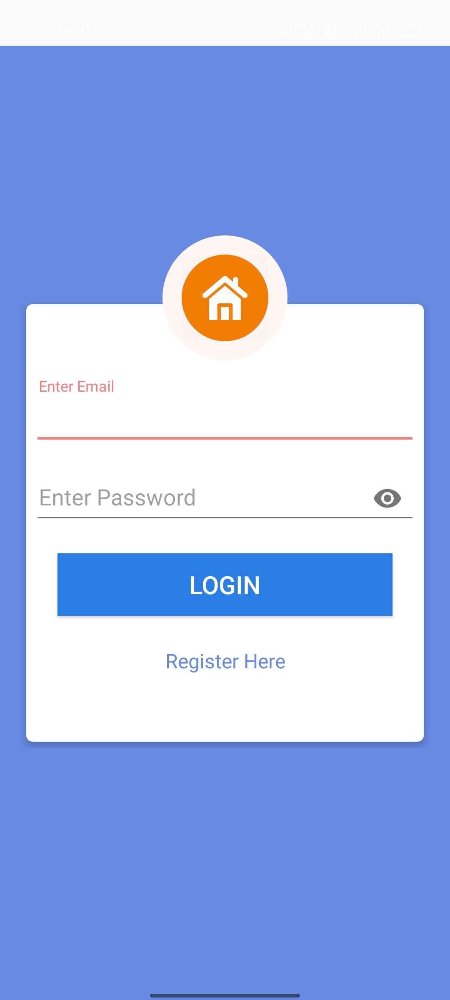
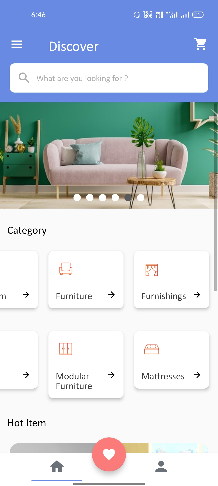
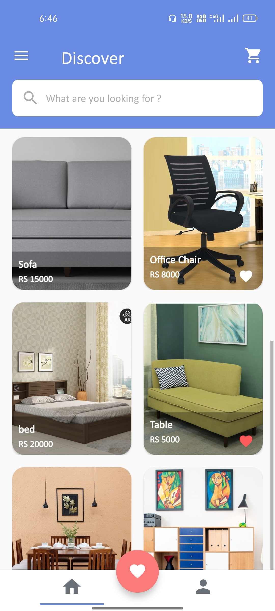
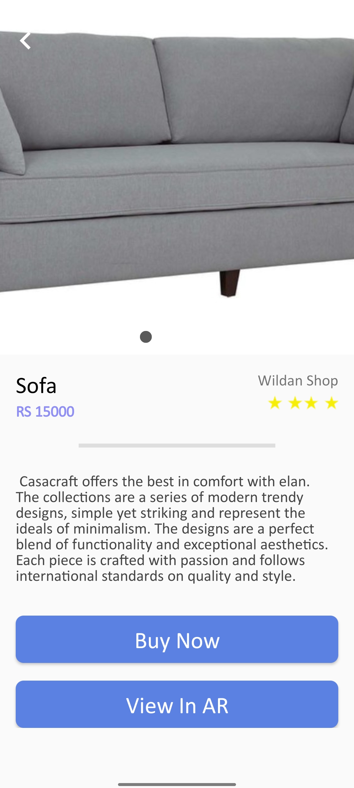
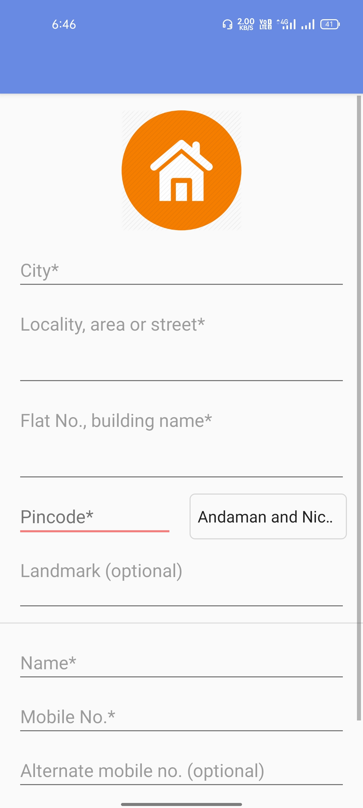
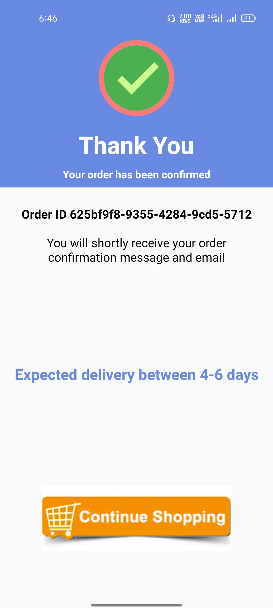
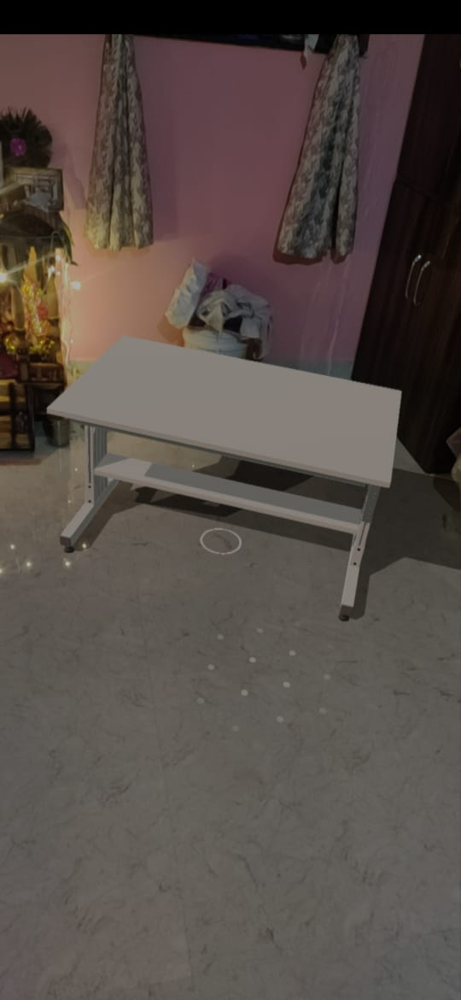
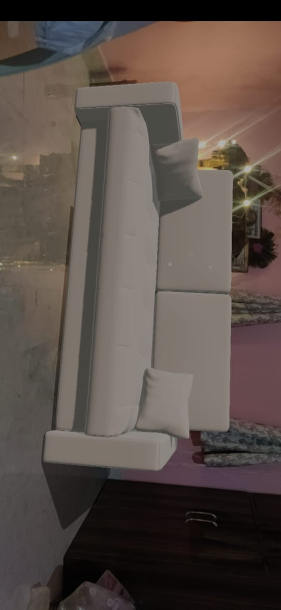

# FurnitureShopping-with-AR

Here is demo of Agumented reality.

<video src='ScreenShot/s10.jpg' width=180/>

This is Android app created in android studio.
First we neew to register into app before login.

  

This is main layout contain three things image slider just like flipkart,category of furniture and trending items.

  
&nbsp; &nbsp; &nbsp; &nbsp;
  

After that clicking on any one product ,details activity  of product will open.
in details Activity  we have two options we can buy product and view in AR. Here have also image slider which represent details of product with perfect size and shape.

  

After click on Buy button Address Activity will open. 

  

After confirmation of address, we have cash on delivery payment option by choosing it we can conform our product.

  

Here is some Agumented reality product images

<table>
  <tr>
    <td>Table AR Object</td>
     <td>Bed  AR</td>
     <td>Sofa AR</td>
  </tr>
  <tr>
    <td></td>
    <td></td>
    <td></td>
  </tr>
 </table>

